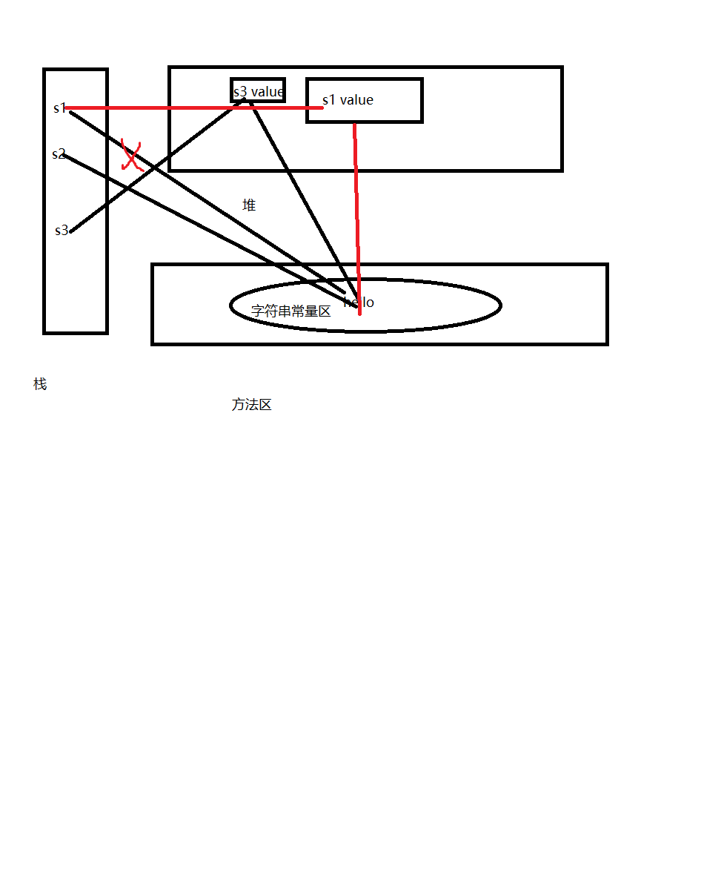

1.画出如下几行待的内容结构

String s1 = "hello";

String s2 = "hello";

String s3 = new String("hello");

s1 += "world";

2.如何理解String类的不可变性

String一经赋值就无法改变，重新赋值都会在常量区新建一个值，而不是修改。

3.String是否可以被继承？为什么？

String s =  new String("hello");在内存中创建了几个对象？请说明

String不可以被继承，因为String是用final修饰的

创建的两个对象，一个在堆空间，一个在方法区中的常量区，s在栈空间指向堆空间，而堆空间指向常量区

4.String StringBuffer StringBuilder

String StringBuffer StringBuilder 底层都是char[]构成的。

String是不可变的 ，因为底层是final char[] value

StringBuffer 和 StringBuilder 都是可变的，可以通过append()在尾部添加数据，而StringBuffer底层很多方法都是添加了Synchornized修饰的，因此StringBuilder线程不安全，效率高，StringBuffer线程安全，效率低。

如果数据不需要修改，使用String

如果数据频繁修改，且需要单线程 使用StringBuilder

如果数据频繁修改，且需要多线程 使用StringBuffer

5.String的常用方法?(至少7分)

 length() charAt() equals() compareTo() endWith() startWith()

contains() indexof() lastIndexof() getBytes() tocharArray()

